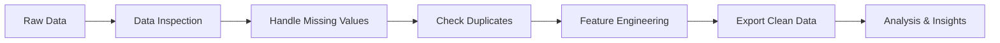

# 🛒 Retail Store Data Analysis Project

## 📋 Project Overview

This project performs comprehensive data analysis on retail store data to extract valuable insights. The analysis includes data preprocessing, feature engineering, and various aggregation techniques to understand sales patterns, customer behavior, and regional performance.

## 🎯 Objectives

- **Data Quality Assurance**: Handle missing values and ensure data integrity
- **Sales Analysis**: Analyze sales trends by product, region, category, and time periods
- **Business Insights**: Generate actionable insights for business decision-making
- **Feature Engineering**: Create meaningful temporal features for deeper analysis

## 📊 Dataset Information

The dataset contains retail transaction data with the following key columns:
- **Order Date**: Transaction date
- **Customer Name**: Customer identifier
- **Product Name**: Product sold
- **Category**: Product category
- **Region/State**: Geographic information
- **Sales**: Transaction amount
- **Postal Code**: Location identifier

## 🔧 Technologies Used

- **Pandas**: Data manipulation and analysis
- **NumPy**: Numerical computing
- **Jupyter Notebook**: Interactive development environment

## 📁 Project Structure

```
Project1/
├── retail_store.ipynb          # Main analysis notebook
├── retail_store_data.csv       # Original dataset
├── final.csv                   # Preprocessed dataset
└── README.md                   # Project documentation
```

## 🚀 Getting Started

### Prerequisites

Make sure you have the following installed:
```bash
pip install pandas numpy jupyter
```

### Installation & Setup

1. **Clone or download the project files**
2. **Navigate to the project directory**:
   ```bash
   cd E:\Pandas\Project1
   ```
3. **Launch Jupyter Notebook**:
   ```bash
   jupyter notebook
   ```
4. **Open `retail_store.ipynb`**

## 📈 Analysis Workflow

### 1. Data Loading & Initial Inspection
- Load the retail store dataset
- Examine data structure, shape, and basic statistics
- Identify data types and missing values

### 2. Data Preprocessing
- **Missing Value Treatment**: Handle missing postal codes using mode imputation
- **Duplicate Detection**: Check and remove duplicate records
- **Data Validation**: Ensure data quality and consistency

### 3. Feature Engineering
- **Temporal Features**: Extract month and year from order dates
- **Date Formatting**: Convert order dates to proper datetime format
- **Month Names**: Transform numeric months to readable month names

### 4. Exploratory Data Analysis
- **Product Performance**: Analyze top-selling products
- **Regional Analysis**: Compare sales across different regions
- **Category Analysis**: Evaluate performance by product categories
- **Temporal Trends**: Examine monthly and yearly sales patterns

## 📊 Key Analyses Performed

### Sales Performance
- ✅ **Top 10 Products by Sales**: Identify best-performing products
- ✅ **Regional Sales Distribution**: Compare performance across regions
- ✅ **Category Performance**: Analyze sales by product categories
- ✅ **Monthly Revenue Trends**: Track seasonal patterns by year

### Data Quality Improvements
- ✅ **Missing Value Imputation**: 41 missing postal codes filled with mode
- ✅ **Duplicate Detection**: Verified no duplicate records exist
- ✅ **Feature Enhancement**: Added Order Month and Order Year columns

## 📋 Key Findings

- **Data Quality**: Successfully cleaned dataset with 0% missing values after preprocessing
- **Temporal Analysis**: Created meaningful time-based features for trend analysis
- **Sales Distribution**: Comprehensive breakdown by multiple dimensions (product, region, category, time)

## 🔄 Data Processing Pipeline



## 📈 Future Enhancements

- **Advanced Analytics**: Customer segmentation and lifetime value analysis
- **Visualization**: Interactive dashboards and charts
- **Predictive Modeling**: Sales forecasting and trend prediction
- **Geographic Analysis**: State-level performance mapping
- **Customer Behavior**: Purchase pattern analysis

## 🎯 Usage Instructions

1. **Run all cells sequentially** in the Jupyter notebook
2. **Modify file paths** if your data is located elsewhere
3. **Customize analysis parameters** based on your specific needs
4. **Export results** to CSV or Excel for further use

## 📝 Output Files

- **`final.csv`**: Cleaned and preprocessed dataset
- **Console outputs**: Various analysis results and summaries

## 🤝 Contributing

Feel free to contribute by:
- Adding new analysis dimensions
- Improving data visualization
- Enhancing feature engineering
- Adding statistical tests and validation

## 📧 Contact

For questions or suggestions about this retail store analysis project, please reach out!

---

**Last Updated**: 24th July, 2025  
**Status**: ✅ Complete - Ready for enhancements